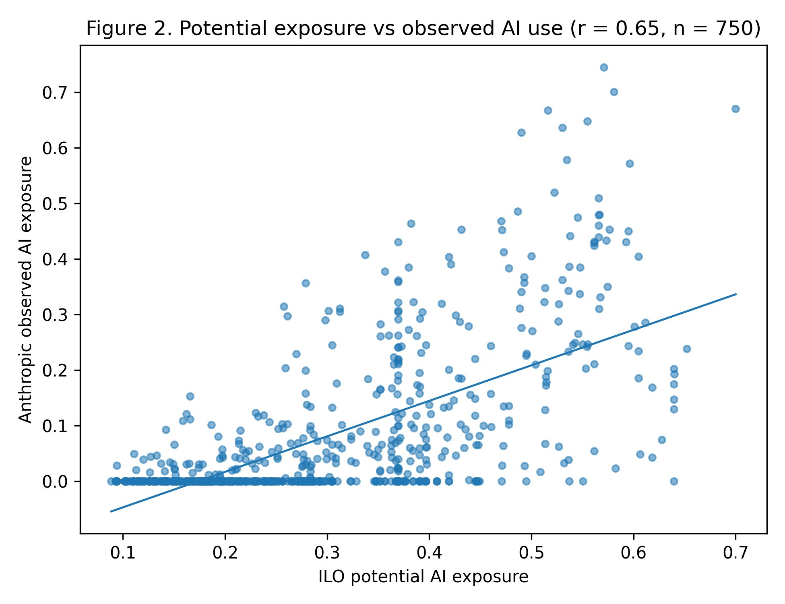
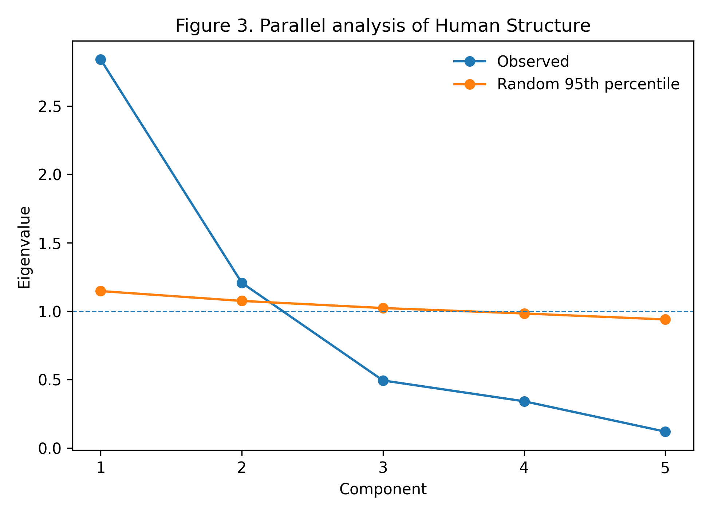
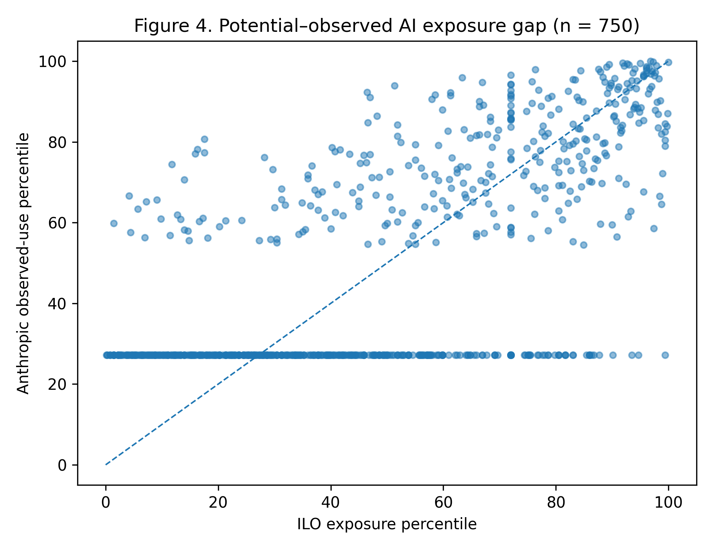
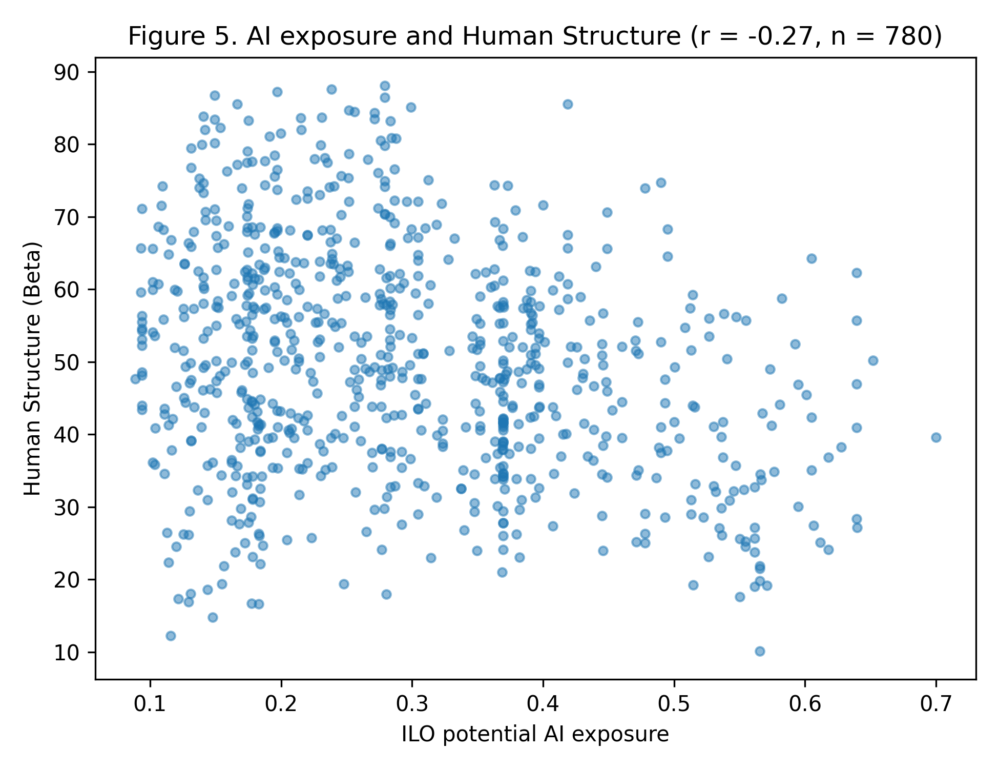
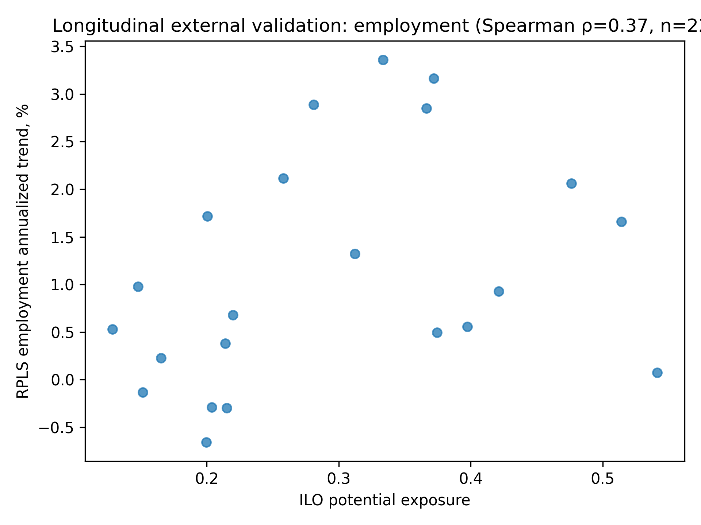

<div align="center">

# FutureCareer Evidence

### Open, explainable career evidence for the AI era

[中文说明](README.zh-CN.md) · [Live Demo](https://zlznzyq.github.io/futurecareer-evidence/)

**867 U.S. occupations · labor-market evidence · AI exposure · observed AI use · human work structure**

[Explore the demo](#-web-showcase) · [Methodology](docs/DATA_PIPELINE.md) · [Results](docs/RESULTS_AT_A_GLANCE.md) · [Contribute](CONTRIBUTING.md)

</div>


## Why this exists

Most AI-career rankings collapse a complex question into one number:

> “How likely is this job to be replaced?”

FutureCareer takes a different approach.

It separates:

**market opportunity · wage · potential AI exposure · observed AI use · human work structure · skills**

Every score should be traceable back to evidence.

## What is already here

| Layer | Current coverage |
|---|---|
| Research unit | **867 SOC6 occupations** |
| O*NET | **31.0** |
| BLS | **2025–2035** |
| ILO AI exposure | mapped |
| Anthropic observed AI use | mapped |
| Human Structure | 5 dimensions |
| Measurement validation | parallel analysis + EFA |
| Independent AI validation | BLS utilization text |
| Web | search + compare + evidence |

## A score is not a probability

If an occupation has a score of **88.4 / 100**, it means it ranks around the 88th percentile on that evidence metric.

It does **not** mean:

> “88.4% chance this career succeeds.”

AI exposure is never converted into:

```text
job safety = 100 − AI exposure
```

## Research result worth knowing

BLS independently identifies occupations affected by AI in its 2025–2035 utilization notes.

Those occupations score substantially higher on both:

- **ILO potential AI exposure — AUC 0.877**
- **Anthropic observed AI use — AUC 0.874**

That supports the validity of the AI measures.

It does **not** imply those occupations will disappear.

[See the full measurement results →](docs/RESULTS_AT_A_GLANCE.md)


## Research previews

| Potential vs observed AI | Human Structure measurement |
|---|---|
|  |  |

| Exposure gap | AI × Human Structure |
|---|---|
|  |  |


## New in v0.6 — public longitudinal labor-market evidence

FutureCareer now adds public RPLS occupation time series for:

- employment;
- job openings;
- hiring and attrition;
- salaries.

The historical layer is SOC2 and is kept separate from the SOC6 career-level analysis. The primary common window is **2022–2026**.



This makes the public research pipeline reproducible without requiring a proprietary job-posting database.

[Read the longitudinal methodology →](docs/LONGITUDINAL_VALIDATION.md)

## Human Structure

Current dimensions:

```text
Physicality
Judgment
Interaction
Responsibility
Context
```

Parallel analysis favors **two underlying factors**, so the overall Human Structure number remains a research-beta summary.

[Read the measurement validation →](docs/V0.3_MEASUREMENT_VALIDATION.md)

## 🌐 Web showcase

Run locally:

```bash
cd web
python -m http.server 8000
```

Open:

```text
http://localhost:8000
```

The showcase supports:

- occupation search;
- exact 0–100 metrics;
- raw BLS evidence;
- AI potential vs observed use;
- Human Structure breakdown;
- three-career comparison;
- “Why?” methodology explanations.

The repository includes a GitHub Pages workflow.

## Reproduce the research

Start here:

1. [`docs/PROCESSING_LOG.md`](docs/PROCESSING_LOG.md)
2. [`docs/DATA_PIPELINE.md`](docs/DATA_PIPELINE.md)
3. [`docs/SCORING.md`](docs/SCORING.md)
4. [`docs/RESEARCH_STATUS.md`](docs/RESEARCH_STATUS.md)

The detailed processing log records the path from raw source → crosswalk → SOC6 aggregation → metric → validation → release.

## Data sources

- O*NET 31.0
- U.S. Bureau of Labor Statistics 2025–2035
- BLS Skills 2025
- ILO GenAI Occupational Exposure 2025
- Anthropic Economic Index
- World Economic Forum Future of Jobs 2025

Third-party data retain their original terms.

## Roadmap

Next:

- publication-ready tables and figures;
- manual QA of extreme exposure-gap occupations;
- stronger construct validation;
- historical hiring data when licensed;
- user comprehension research;
- international expansion.

See [`ROADMAP.md`](ROADMAP.md).

## Contributing

Found a questionable occupation mapping or metric?

That is exactly the kind of contribution this project needs.

[Open an Issue or read the contribution guide →](CONTRIBUTING.md)

## Status

**v0.6.0 Open Research Beta — release candidate**

The project is intentionally open about uncertainty. Methods may change when better evidence arrives.

---

<div align="center">

**Same data. Better questions. Better career decisions.**

</div>
